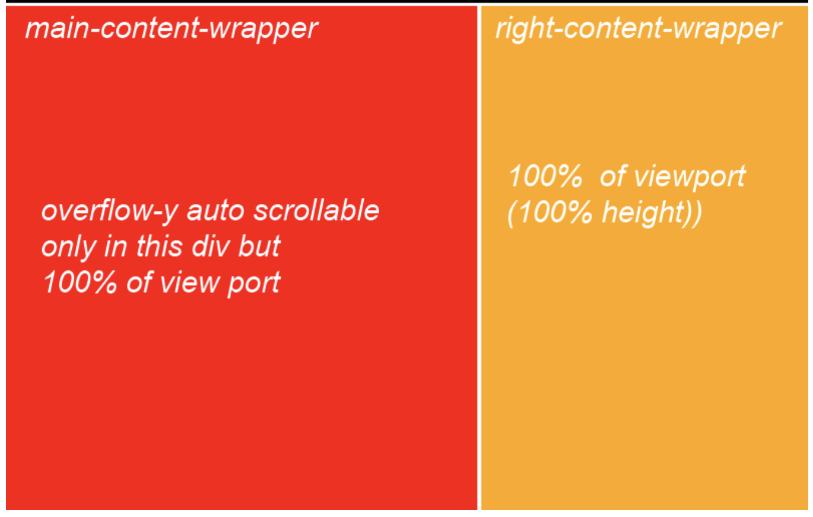

# Target
Make a div 100% height and overflow with bootstrap

# Example
### HTML code segment
```
<section class="content">
    <div class="container-fluid">
        <div class="row">
            <div class="col-sm-12">
                <!-- Content -->
                <div class="row">
                    <div class="col-xs-8">
                        <div class="main-container-wrapper">
                            <h1>Content</h1>
                        </div>
                    </div>
                    <div class="col-xs-4">
                        <div class="right-container-wrapper">
                            <h3>Chat</h3>
                        </div>
                    </div>
                </div>
            </div>
        </div>
    </div>
</section>
```

### CSS code segment
```
.col-xs-8{
  background-color:red;
  overflow-y:scroll;
  max-height: 100vh;
}
```
### Output


# Reference
https://stackoverflow.com/questions/36988442/100-height-and-overflow-with-bootstrap